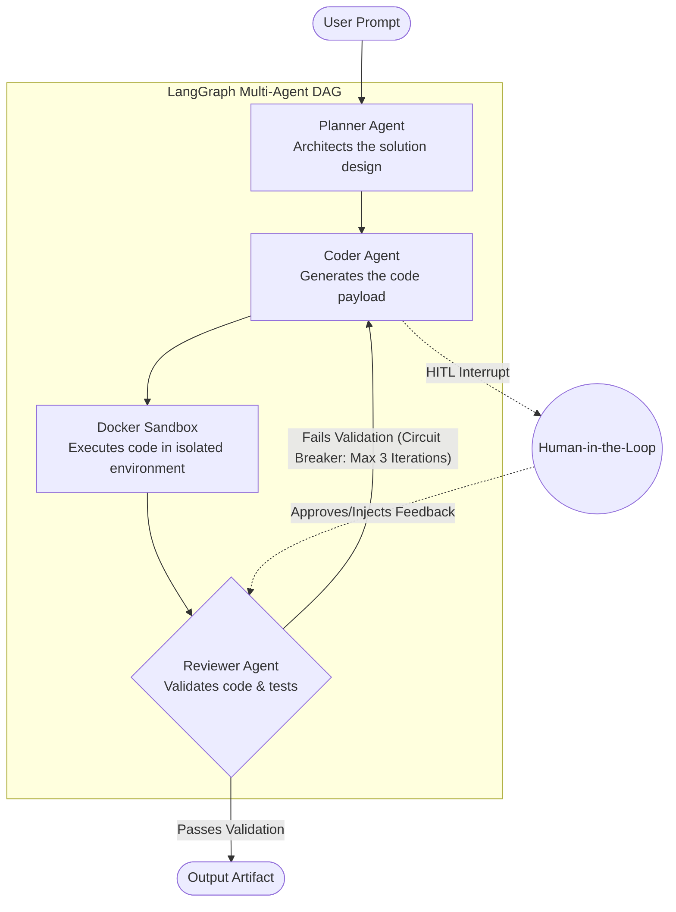

# AgenticForge

> **Autonomous Multi-Agent Software Development Studio**
>
> An enterprise-grade generative AI platform that orchestrates autonomous agents to architect, generate, and validate software with robust state management, sandboxed execution, and real-time bidirectional streaming.


---

## 🧭 Overview & Value Proposition

AgenticForge is a full-stack SaaS platform designed to transition Generative AI from simple chat interfaces into resilient, product-minded engineering workflows. By decoupling complex reasoning into a structured **Directed Acyclic Graph (DAG)** of specialized agents, the system achieves deterministic, fault-tolerant code generation. It pairs this autonomous capability with a strict **network-isolated Docker sandbox** for zero-trust code execution and an enterprise-ready backend featuring **Bring-Your-Own-Key (BYOK) Fernet encryption**, JWT rotation, and asynchronous checkpointing. 

---

## 🏗️ High-Level Architecture

AgenticForge utilizes a multi-agent orchestration pipeline. The state of the workflow is durably persisted across iterations, ensuring that failures can be resumed and that humans can intervene before critical execution steps.



### Real-Time Pipeline
- **WebSocket Streaming:** As the LangGraph DAG executes, the backend emits **Pydantic-typed StreamEvents** via a full-duplex WebSocket connection. The React frontend consumes this stream to render live agent thoughts, token usage, and sandboxed stdout logs.
- **Resilience:** The streaming layer implements heartbeat keep-alives and exponential-backoff reconnection, falling back to a REST API polling mechanism to guarantee **zero data loss** on network interruption.

---

## ⚙️ Core Features

- **Stateful AI Workflows:** 
  Orchestrated via LangGraph, the pipeline utilizes **conditional self-healing loops** to iteratively fix broken code. It enforces an iteration **circuit breaker** to prevent infinite loops and features a **Human-in-the-Loop (HITL)** pause, allowing users to inject context or approve code mid-flight. Checkpointing is handled durably via an `AsyncSqliteSaver` (with a migration path to PostgreSQL).
- **Secure Execution Engine:** 
  Generated code is evaluated against a **sandboxed Docker execution environment**. The container is strictly network-isolated, constrained by a 128MB memory cap, and enforced by a 15-second execution timeout to prevent malicious exploits or resource exhaustion.
- **Provider-Agnostic LLM Gateway:** 
  Built on a **Factory Pattern**, the backend seamlessly routes generation tasks across Groq, OpenAI, and Anthropic. User-provided API keys are secured via **Bring-Your-Own-Key (BYOK)** methodology, encrypted at rest using symmetric **Fernet encryption**.
- **Monorepo & DevOps Automation:** 
  Engineered for production scale. The backend utilizes **multi-stage Docker builds** executing under a non-root `appuser`. Database schema evolution is strictly managed via **Alembic migrations**. The architecture supports programmatic, one-click artifact deployment directly to Vercel/Netlify edge networks.
- **SaaS Monetization Engine:** 
  Integrated deeply with **Stripe webhooks** for asynchronous subscription lifecycle management, gated tier access, and usage-based access controls over premium LLM models.

---

## 🛠️ Tech Stack

**Frontend Architecture**
- **Core:** React 19, TypeScript
- **State Management:** Zustand, React Context
- **UI/Visualization:** React Flow (DAG visualization), TailwindCSS, Framer Motion
- **Build Tooling:** Vite 8

**Backend Architecture**
- **Core:** FastAPI, Python 3.12+
- **Data & Auth:** SQLAlchemy 2.0, Alembic, Pydantic v2, JWT (Jose)
- **Dependency Management:** `uv` (for deterministic, sub-second dependency resolution)
- **Security:** Passlib (Bcrypt), Cryptography (Fernet)

**AI & Orchestration**
- **Frameworks:** LangGraph, LangChain
- **LLM Integrations:** Groq, OpenAI, Anthropic (Claude)

**Infrastructure & DevOps**
- **Containerization:** Docker (Multi-stage, Sandboxed runtime)
- **Cloud Delivery:** Vercel (Edge SPA), Koyeb/Fly.io (Backend Containers)
- **Payments:** Stripe API

---

## 🚀 Getting Started

### Prerequisites
- Docker & Docker Compose
- `uv` Python Package Manager
- Node.js (v20+) & npm

### 1. Backend Setup

```bash
cd backend

# Create a deterministic virtual environment
uv venv .venv
source .venv/bin/activate

# Install dependencies from the lockfile
uv pip install -r pyproject.toml

# Copy the environment template
cp .env.example .env
```

**Configure `backend/.env`:**
You must provide secure hex strings for cryptographic operations.
```ini
ENVIRONMENT="development"
SECRET_KEY="<generate with: python -c 'import secrets; print(secrets.token_hex(32))'>"
ENCRYPTION_KEY="<generate with: python -c 'from cryptography.fernet import Fernet; print(Fernet.generate_key().decode())'>"
DATABASE_URL="sqlite:///./agentic_forge.db"
# Provide at least one platform fallback key
GROQ_API_KEY="gsk_..."
```

**Run the Backend Server:**
```bash
# Apply database migrations
alembic upgrade head

# Start the FastAPI server
uvicorn app.main:app --host 0.0.0.0 --port 8000 --reload
```

### 2. Frontend Setup

```bash
cd frontend

# Install dependencies
npm install

# Copy the environment template
cp .env.production.example .env.local
```

**Configure `frontend/.env.local`:**
```ini
VITE_APP_NAME="AgenticForge"
VITE_API_BASE_URL="http://localhost:8000/api/v1"
VITE_WS_BASE_URL="ws://localhost:8000/api/v1"
```

**Run the Frontend Development Server:**
```bash
npm run dev
```

---

## 📂 Repository Structure

The monorepo strictly separates the presentation layer from the asynchronous orchestration engine.

### Backend Directory (`/backend`)
```text
backend/
├── app/
│   ├── api/          # FastAPI REST controllers and WebSocket routing handlers
│   ├── core/         # System configurations, JWT Security, and exception middleware
│   ├── db/           # SQLAlchemy session lifecycle and Alembic migration tracking
│   ├── models/       # ORM definitions (Users, Projects, Billing)
│   ├── schemas/      # Pydantic v2 data transfer objects and StreamEvent contracts
│   └── services/     # LangGraph orchestration, Factory-pattern LLM dispatchers
├── alembic.ini       # Alembic environment config
├── Dockerfile        # Production-hardened, multi-stage, non-root container spec
├── pyproject.toml    # Python project definition
└── uv.lock           # Deterministic dependency resolution tree
```

### Frontend Directory (`/frontend`)
```text
frontend/
├── public/           # Uncompiled static assets
├── src/
│   ├── components/   # Modular UI primitives and composite elements
│   ├── config/       # Environment-aware client configuration
│   ├── hooks/        # Custom React hooks (e.g., useWebSocketStream)
│   ├── pages/        # Application view boundaries
│   ├── services/     # Axios API singletons and WebSocket class wrappers
│   ├── store/        # Zustand global state slices
│   └── types/        # TypeScript interface definitions mapping to backend Pydantic models
├── package.json      # Node dependency manifest
├── tailwind.config.js# Design system tokens
└── vite.config.js    # Vite build and local proxy configuration
```
